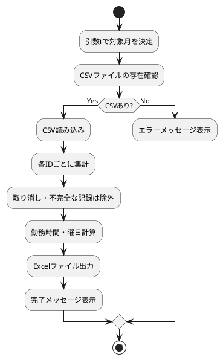

# makeworklist.py ドキュメント

## 概要
このモジュールは、勤怠記録CSVファイルから月ごとの出勤簿を集計し、Excelファイルとして出力するための関数を提供します。

## 関数一覧

### make_work_list(i=0)
指定した月の出勤簿をExcel形式で出力します。

#### 引数
- i (int, デフォルト0):
    - 0: 今月分の出勤簿を出力
    - 1: 先月分の出勤簿を出力
    - 2: 2ヶ月前 ...

#### 処理概要
1. 今日からiヶ月前の年月を計算し、"YYYY-MM"形式の文字列に変換します。
2. datas/配下に該当月のCSVファイルが存在するか確認します。
3. ファイルが存在しない場合はエラーメッセージを表示して終了します。
4. ファイルが存在する場合はpandasで読み込み、各勤務IDごとに「開始」「終了」「フィードバック」を抽出します。
5. 「取り消し」レコードがある勤務は除外します。
6. 勤務時間（分）と曜日を計算し、出力用DataFrameにまとめます。
7. ユーザーのDownloadsフォルダに「YYYY-MM_出勤簿.xlsx」として保存します。

#### 出力
- Excelファイル（例: ~/Downloads/2026-02_出勤簿.xlsx）
- 標準出力に完了メッセージ

## CSVファイルの前提
- ファイル名: datas/YYYY-MM.csv
- 必須カラム: ID, Activity, Time stamp, Feed back

## フロー図（処理の流れ）


## 使用例
```python
import makeworklist
makeworklist.make_work_list(0)  # 今月分
makeworklist.make_work_list(1)  # 先月分
```

## 注意事項
- CSVファイルが存在しない場合は何も出力されません。
- 勤務記録が「開始」「終了」両方揃っていない場合は出力されません。
- 「取り消し」レコードがある勤務は除外されます。
